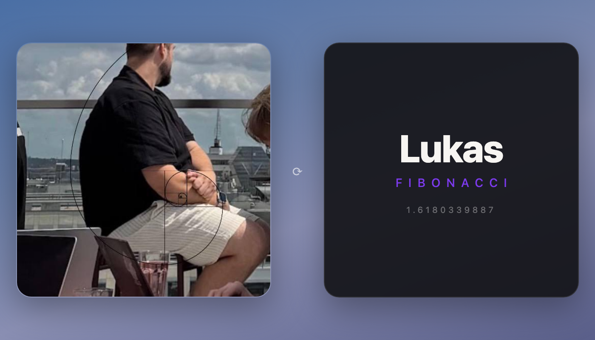

# Lukas Fibonacci

A continuously rotating, double-sided desktop card of **Lukas Fibonacci**, rendered by [Übersicht](https://tracesof.net/uebersicht/) on macOS.

Front: the legend himself. Back: the golden ratio.



## Install (copy-paste)

1. Install Übersicht:

   ```bash
   brew install --cask ubersicht
   ```

2. Copy the widget into your widgets folder:

   ```bash
   cp -R lukas-fibonacci.widget "$HOME/Library/Application Support/Übersicht/widgets/"
   ```

3. Launch Übersicht. Lukas appears top-right and starts rotating.

## Configuration

Everything lives in `lukas-fibonacci.widget/index.coffee`:

- `size = 354` — one number, the whole card scales (square, adaptive typography)
- `top` / `left` in `style:` — position
- `animation: flip 6s linear infinite` — rotation speed
- The photo is embedded as base64 in `render:` — swap the data URI to rotate someone else

## License

MIT
